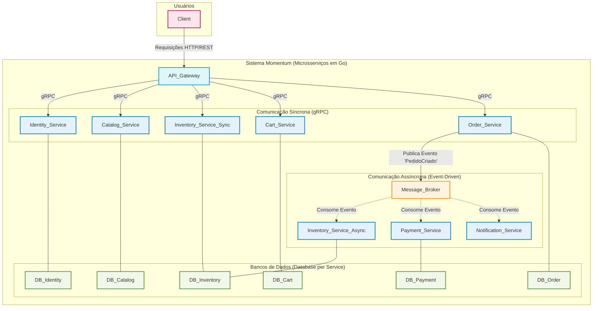

# Arquitetura para Impacto: Um Blueprint de Microsserviços em Golang para uma Plataforma de E-commerce de Alta Transação

## 1. O Imperativo Estratégico: Por Que Este Projeto Vai Garantir Sua Contratação em 2025

Este projeto não é apenas uma aplicação, mas uma vitrine das habilidades mais demandadas do mercado de tecnologia em 2025. Go (Golang) tornou-se a linguagem padrão para arquiteturas cloud-native, microsserviços e sistemas de alta performance. Empresas como Google, Uber, Netflix, Mercado Livre e PayPal apostam em Go para resolver desafios de escala, resiliência e eficiência. O domínio de Go, aliado à arquitetura de microsserviços, é um diferencial competitivo comprovado, refletido em salários elevados e alta demanda global.

### 1.1. Go: A Língua Franca da Era Cloud-Native
- Go é a linguagem preferida para sistemas distribuídos, cloud-native e aplicações de alta concorrência.
- 89% das organizações já adotaram tecnologias cloud-native, e Go é protagonista nesse cenário.
- Go está no top 10 do índice TIOBE (2025) e cresce 17% ao ano em vagas.
- Projetada para performance, concorrência massiva (goroutines), deploy simplificado e legibilidade.

### 1.2. Por que Microsserviços?
- Escalabilidade independente de componentes.
- Resiliência: falhas isoladas não derrubam o sistema.
- Padrão em plataformas de alta transação (Mercado Livre, Uber, Allegro).
- Permite adoção de padrões avançados: Saga, CQRS, Event-Driven, mensageria (Kafka/RabbitMQ).

### 1.3. O que este projeto prova sobre você
- Capacidade de projetar sistemas escaláveis, resilientes e prontos para produção.
- Proficiência em Go, gRPC, Docker, Kubernetes, mensageria e observabilidade.
- Conhecimento prático de padrões de arquitetura usados pelas maiores empresas do mundo.

---

## 2. Visão de Negócio: Momentum — Um Marketplace de Alta Concorrência

Momentum não é uma simples loja virtual. É um marketplace projetado para desafios reais: picos de tráfego (Black Friday), múltiplos vendedores, inventário em tempo real, processamento e fulfillment de pedidos complexos. Cada serviço representa um domínio de negócio essencial:

- **Identidade e Acesso:** Registro, login, perfis, papéis (cliente, vendedor, admin).
- **Catálogo de Produtos:** Produtos, categorias, marcas, busca e filtragem eficiente.
- **Inventário:** Estoque em tempo real, reservas, alertas de baixo estoque.
- **Carrinho e Pedidos:** Adição/remoção de itens, checkout, histórico de pedidos.
- **Pagamentos:** Integração com gateways externos, autorizações, estornos.
- **Notificações:** E-mails, SMS, push para eventos transacionais.

---

## 3. Desafios Técnicos e Soluções Arquiteturais

### 3.1. Escalabilidade
Escalabilidade horizontal de serviços, uso de mensageria para desacoplamento, deploy em Kubernetes.

### 3.2. Resiliência
Isolamento de falhas, retries, circuit breakers, event-driven para garantir continuidade mesmo com falhas parciais.

### 3.3. Consistência de Dados
Padrão Saga para transações distribuídas, cada serviço com seu próprio banco (Database per Service), eventos de compensação.

### 3.4. Performance
gRPC para comunicação interna (baixa latência), REST para API pública, uso de Redis para operações críticas de estoque.

### 3.5. Observabilidade
Logging estruturado (Zap), métricas (Prometheus/Grafana), tracing distribuído (OpenTelemetry/Jaeger).

### 3.6. Segurança
JWT centralizado no API Gateway, autorização baseada em papéis, TLS entre serviços.

---

## 4. Blueprint Arquitetural

### 4.1. Diagrama de Alto Nível
Veja o diagrama Mermaid abaixo para a visão macro dos microsserviços, bancos e fluxos síncronos/assíncronos.


# Momentum E-commerce (Microsserviços em Go)

Momentum é um projeto de portfólio que demonstra uma arquitetura moderna de e-commerce baseada em microsserviços escritos em Go. O sistema é dividido em serviços independentes, cada um responsável por uma parte fundamental do domínio de e-commerce, utilizando comunicação síncrona (gRPC) e assíncrona (event-driven/Saga). Este repositório contém o serviço de identidade, mas o projeto é planejado para ser expandido com múltiplos serviços.


## Visão Arquitetural




## 5. Fases de Construção e Roadmap

### Fase 1: Fundação (Dados Mestres e Segurança)
- **identity-service:** Registro, login, validação de usuários (JWT).
- **catalog-service:** CRUD de produtos, busca e filtragem.

### Fase 2: Experiência de Compra (Pré-Transação)
- **inventory-service:** Estoque, reservas, alertas.
- **cart-service:** Adição/remoção de itens, visualização do carrinho.

### Fase 3: Núcleo Transacional (A Compra)
- **order-service:** Orquestração de pedidos, publicação de eventos.
- **payment-service:** Processamento de pagamentos, integração com gateways.

### Fase 4: Suporte e Pós-Transação
- **notification-service:** E-mails, SMS, push.

### Componentes Contínuos
- **API Gateway:** Roteamento, autenticação, agregação de respostas.
- **Mensageria (Kafka/RabbitMQ):** Backbone de eventos.

> Seguir essa ordem garante uma base sólida, com cada novo serviço adicionando funcionalidade testável e de valor para o negócio.


## 6. Estrutura do Projeto (Exemplo para identity-service)
```
services/
   identity/
      main.go                # Entrypoint do serviço de identidade
      database/              # Conexão, migração e seed do banco
      models/                # Modelos de domínio (User, Role, Permission)
      server/                # Implementação dos handlers gRPC
      services/              # Lógica de negócio (ex: UserService)
      utils/                 # Utilitários
shared/
   helpers.go               # Funções utilitárias compartilhadas
   identity.proto           # Definição da API gRPC
   logger.go                # Configuração do logger
   v1/proto/                # Códigos gerados do Protobuf
```


## 7. Como rodar localmente (identity-service)
1. **Pré-requisitos:**
   - Go 1.20+
   - Docker e Docker Compose

2. **Configuração:**
   - Copie o arquivo `.env.example` para `.env` e ajuste as variáveis de ambiente conforme necessário.

3. **Suba os serviços:**
   ```fish
   docker compose up --build
   ```

4. **Acesse o serviço:**
   - O serviço gRPC estará disponível na porta definida por `IDENTITY_GRPC_PORT` (padrão: 50051).


## 8. Stack Tecnológico
| Categoria         | Tecnologia           | Justificativa |
|-------------------|---------------------|--------------|
| Linguagem         | Go 1.2x             | Performance, concorrência, cloud-native |
| Web (REST)        | Gin                 | API Gateway minimalista e performático |
| RPC Interno       | gRPC-go             | Comunicação eficiente, contratos fortes |
| Containerização   | Docker              | Deploy consistente |
| Orquestração      | Kubernetes          | Escalabilidade, auto-recuperação |
| API Gateway       | Kong                | Plugins, autenticação, rate limiting |
| Mensageria        | Apache Kafka        | Backbone de eventos, Saga |
| Banco de Dados    | PostgreSQL, Redis   | ACID (transações), alta performance |
| Observabilidade   | Prometheus, Grafana, Jaeger | Métricas, dashboards, tracing |


## 9. Observações e Orientações de Carreira
- Este projeto é voltado para fins de estudo e portfólio, demonstrando padrões profissionais de desenvolvimento backend e arquitetura de microsserviços.
- Documente decisões arquiteturais (ADRs) para mostrar maturidade.
- Use exemplos de uso de API (curl/Postman) para facilitar avaliação.
- Destaque no currículo: "Projetei e construí uma plataforma de e-commerce cloud-native baseada em Go, com microsserviços, Saga, CQRS, gRPC, REST, Docker, Kubernetes e mensageria."
- Prepare-se para entrevistas de system design usando este projeto como case real.


## 10. Autor
Gabriel Hamasaki

---

> Projeto desenvolvido para fins de portfólio. Não utilize em produção sem as devidas adaptações de segurança.
