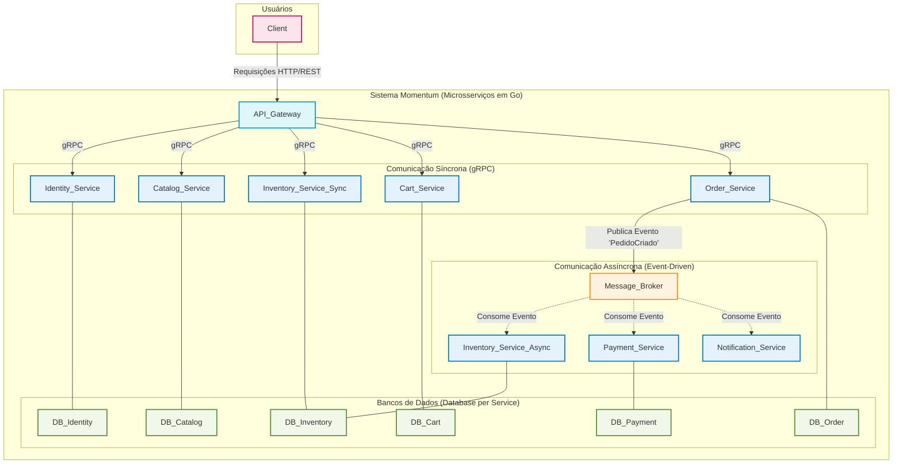

# Momentum E-commerce (Microsserviços em Go)

Momentum é um projeto de portfólio que demonstra uma arquitetura moderna de e-commerce baseada em microsserviços escritos em Go. O sistema é dividido em serviços independentes, cada um responsável por uma parte fundamental do domínio de e-commerce, utilizando comunicação síncrona (gRPC) e assíncrona (event-driven/Saga). Este repositório contém o serviço de identidade, mas o projeto é planejado para ser expandido com múltiplos serviços.


## Visão Arquitetural



## Fases de Construção

### Fase 1: A Fundação (Dados Mestres e Segurança)
- **Serviço de Identidade (identity-service):** Endpoints para registrar, logar e validar usuários (autenticação/JWT).
- **Serviço de Catálogo de Produtos (catalog-service):** APIs para criar, listar e buscar produtos.

### Fase 2: A Experiência de Compra Principal (Pré-Transação)
- **Serviço de Inventário (inventory-service):** API para consultar e gerenciar o estoque de um produto.
- **Serviço de Carrinho (cart-service):** Funcionalidade para adicionar, remover e visualizar itens no carrinho de um usuário.

### Fase 3: O Núcleo Transacional (A Compra)
- **Serviço de Pedidos (order-service):** Orquestração da compra, publicação do evento PedidoCriado.
- **Serviço de Pagamentos (payment-service):** Consome eventos de pedido e processa pagamentos.

### Fase 4: Serviços de Suporte e Pós-Transação
- **Serviço de Notificações (notification-service):** Consome eventos e envia notificações (e-mail/SMS).

### Componentes Contínuos
- **API Gateway:** Inicialmente roteia para identity-service, evolui conforme novos serviços são criados.
- **Infraestrutura de Mensageria (Kafka/RabbitMQ):** Necessária para comunicação assíncrona a partir da Fase 3.

Seguir essa ordem garante uma base sólida, com cada novo serviço adicionando funcionalidade testável e de valor para o negócio.


## Estrutura do Projeto (Exemplo para identity-service)
```
services/
   identity/
      main.go                # Entrypoint do serviço de identidade
      database/              # Conexão, migração e seed do banco
      models/                # Modelos de domínio (User, Role, Permission)
      server/                # Implementação dos handlers gRPC
      services/              # Lógica de negócio (ex: UserService)
      utils/                 # Utilitários
shared/
   helpers.go               # Funções utilitárias compartilhadas
   identity.proto           # Definição da API gRPC
   logger.go                # Configuração do logger
   v1/proto/                # Códigos gerados do Protobuf
```


## Como rodar localmente (identity-service)
1. **Pré-requisitos:**
   - Go 1.20+
   - Docker e Docker Compose

2. **Configuração:**
   - Copie o arquivo `.env.example` para `.env` e ajuste as variáveis de ambiente conforme necessário.

3. **Suba os serviços:**
   ```fish
   docker compose up --build
   ```

4. **Acesse o serviço:**
   - O serviço gRPC estará disponível na porta definida por `IDENTITY_GRPC_PORT` (padrão: 50051).


## Tecnologias Utilizadas
- Go
- gRPC
- Protocol Buffers
- Zap Logger
- Docker
- PostgreSQL (sugestão para banco de dados)
- Kafka/RabbitMQ (mensageria)


## Observações
- Este projeto é voltado para fins de estudo e portfólio, demonstrando padrões profissionais de desenvolvimento backend e arquitetura de microsserviços.
- Sinta-se à vontade para clonar, estudar e adaptar para seus próprios projetos!


## Autor
Gabriel Hamasaki

---

> Projeto desenvolvido para fins de portfólio. Não utilize em produção sem as devidas adaptações de segurança.
